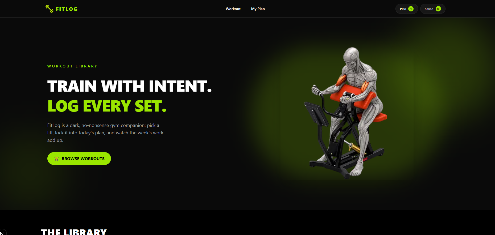
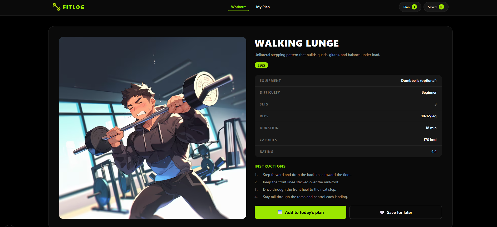
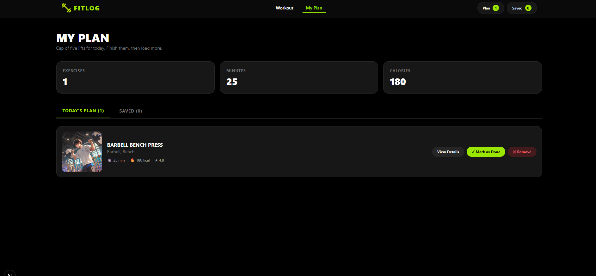

# 🏋️ FITLOG — Workout Library

> **Train with intent. Log every set.**

A dark, no-nonsense gym companion built with Next.js. Pick a lift, lock it into today's plan, and watch the week's work add up.

---

## 📸 Screenshots

### Home Page — Hero & Library

### Workout Details Page

### My Plan Page

---

## 🛠️ Technologies Used

| Technology | Purpose |
| :--- | :--- |
| **Next.js 16** (App Router) | React framework with SSR, routing, and server components |
| **React 19** | UI library |
| **TypeScript** | Type safety |
| **Tailwind CSS** | Styling and responsive design |
| **DaisyUI** | UI component library |
| **React-Toastify** | Toast notifications |
| **Context API** | Global state management |
| **localStorage** | Data persistence |
| **Vercel** | Deployment |

---

## ✨ Key Features

### ১. 🎯 Workout Library (12+ Lifts)
Browse a curated collection of 12 workouts with images, category tags, equipment info, duration, calories, and ratings.

### ২. 📋 Detailed Workout Pages
Each workout has a dedicated page with a full spec table (equipment, difficulty, sets, reps, duration, calories, rating) and step-by-step instructions.

### ৩. 📅 Today's Plan
Add any workout to your daily plan with one click. The plan has a **cap of 5 lifts** —perfect for focused sessions.

### ৪. 💾 Save for Later
Bookmark workouts for future sessions. Your saved items persist even after page reload.

### ৫. 📊 Live Metrics Summary
Watch your Exercises, Minutes, and Calories counters update live as you add or remove workouts from your plan.

### ৬. 🎨 Modern Dark UI
Sleek, modern dark theme with a lime-green accent, inspired by the Figma design.

### ৭. 📱 Fully Responsive
Works seamlessly on mobile, tablet, and desktop devices.

### ৮. 🔔 Toast Notifications
Get instant feedback on every action (add, save, remove, mark done).

### ৯. 🔄 Sort Workouts
Sort the library by **Duration**, **Calories**, or **Rating** with a single click.

### ১০. ♿ 404 Page + Loading State
Graceful handling of unknown routes and loading states while data fetches.

---

## 📁 Project Structure

fitlog/
├── src/
│ ├── app/
│ │ ├── Component/
│ │ │ └── Homepage/
│ │ │ ├── Banner.tsx # Hero section
│ │ │ ├── Navbar.tsx # Top navigation
│ │ │ ├── NavLink.tsx # Active nav link
│ │ │ ├── NavCounts.tsx # Plan/Saved counters
│ │ │ ├── Library.tsx # Library section (server)
│ │ │ ├── LibrarySort.tsx # Sort dropdown (client)
│ │ │ ├── Librarycard.tsx # Workout card
│ │ │ └── Footer.tsx # Footer
│ │ │
│ │ ├── workout/
│ │ │ ├── page.tsx # All workouts
│ │ │ └── [id]/
│ │ │ ├── page.tsx # Workout details (server)
│ │ │ └── PlanButtons.tsx # Add/Save buttons (client)
│ │ │
│ │ ├── my-plan/
│ │ │ └── page.tsx # Plan & Saved tabs
│ │ │
│ │ ├── api/
│ │ │ └── workouts/
│ │ │ └── route.ts # API proxy route
│ │ │
│ │ ├── layout.tsx # Root layout
│ │ ├── page.tsx # Home page
│ │ ├── loading.tsx # Loading UI
│ │ ├── not-found.tsx # 404 page
│ │ └── globals.css # Global styles
│ │
│ ├── context/
│ │ └── PlanContext.tsx # Global state (plan + saved)
│ │
│ └── types/
│ └── types.ts # TypeScript interfaces
│
├── public/
│ └── screenshots/ # README screenshots
│
├── package.json
├── tsconfig.json
├── tailwind.config.js
└── README.md